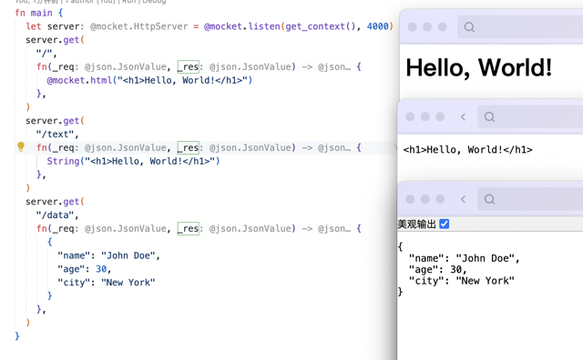

# oboard/mocket

MoonBit HTTP server library

## Usage

### Prerequisites
- MoonBit SDK installed
- Node.js installed

### Linux/MacOS:
```bash
sudo chmod +x ./start.sh
./start.sh
```

### Windows:
```bat
start.bat
```

## Example usage
```rust
// Example usage of mocket package in MoonBit

fn main {
  let server = @mocket.listen(get_context(), 4000)

  // html response example
  server.get(
    "/",
    fn(_req, _res) {
      @mocket.html("<h1>Hello, World!</h1>")
    },
  )

  // text response example
  server.get(
    "/text",
    fn(_req, _res) {
      String("<h1>Hello, World!</h1>")
    },
  )

  // json data example
  server.get(
    "/data",
    fn(_req, _res) {
      {
        "name": "John Doe",
        "age": 30,
        "city": "New York"
      }
    },
  )

  // post request example
  server.post(
    "/echo",
    fn(req, _res) {
      match req {
        { "body": data } => data
        _ => String("No data received")
      }
    },
  )
}
```

