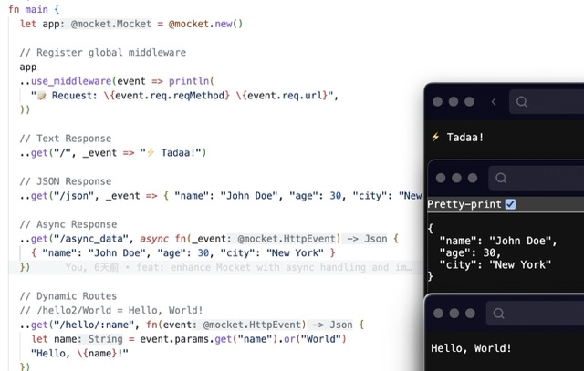

# oboard/mocket

[](https://mooncakes.io/docs/oboard/mocket)
[](https://github.com/oboard/mocket/actions/workflows/check.yaml)
[](https://github.com/oboard/mocket/blob/main/LICENSE)


A web framework for MoonBit.




## Quick Start

It's necessary to set the backend of MoonBit to `js` in `Visual Studio Code`

Command: `MoonBit: Select Backend` -> `js`

```bash
moon run src/main/main.mbt --target js
```

Then visit http://localhost:4000

## Usage

Minimum Example: https://github.com/oboard/mocket_example

## Features

### Dynamic Routes

Support named parameters with `:param` syntax:

```moonbit
app.get("/hello/:name", fn(event) {
  let name = event.params.get("name").or("World")
  "Hello, \{name}!"
})
```

### Wildcard Routes

Support single and double wildcards:

```moonbit
// Single wildcard - matches one path segment
app.get("/hello/*", fn(event) {
  let name = event.params.get("_").or("World")
  "Hello, \{name}!"
})

// Double wildcard - matches multiple path segments
app.get("/hello/**", fn(event) {
  let path = event.params.get("_").or("")
  "Hello, \{path}!"
})
```

### Async Support

The library supports async/await for I/O operations:

### Async /GET Example

```moonbit
// async json data example
app.get("/async_data", async fn(event) {
  { "name": "John Doe", "age": 30, "city": "New York" }
})
```

### Route Groups

Group related routes under a common base path with shared middleware:

```moonbit
app.group("/api", group => {
  // Add group-level middleware
  group.use_middleware(event => println(
    "🔒 API Group Middleware: \{event.req.reqMethod} \{event.req.url}",
  ))
  
  // Routes under /api prefix
  group.get("/hello", _ => "Hello from API!")
  group.get("/users", _ => { "users": ["Alice", "Bob"] })
  group.post("/data", e => e.req.body.to_json())
})
```

This creates routes:
- `GET /api/hello`
- `GET /api/users` 
- `POST /api/data`

All routes in the group will execute the group middleware in addition to any global middleware.

## Example usage

```moonbit
fn main {
  
  let app = @mocket.new()

  // Register global middleware
  app
  ..use_middleware(event => println(
    "📝 Request: \{event.req.reqMethod} \{event.req.url}",
  ))

  // Text Response
  ..get("/", _event => "⚡️ Tadaa!")

  // Route Groups with middleware
  ..group("/api", group => {
    // Add group-level middleware
    group.use_middleware(event => println(
      "🔒 API Group Middleware: \{event.req.reqMethod} \{event.req.url}",
    ))
    group.get("/hello", _ => "Hello from API!")
    group.get("/json", _ => {
      "name": "John Doe",
      "age": 30,
      "city": "New York",
    })
  })

  // JSON Response
  ..get("/json", _event => { "name": "John Doe", "age": 30, "city": "New York" })

  // Async Response
  ..get("/async_data", async fn(_event) {
    { "name": "John Doe", "age": 30, "city": "New York" }
  })

  // Dynamic Routes
  // /hello2/World = Hello, World!
  ..get("/hello/:name", fn(event) {
    let name = event.params.get("name").or("World")
    "Hello, \{name}!"
  })
  // /hello2/World = Hello, World!
  ..get("/hello2/*", fn(event) {
    let name = event.params.get("_").or("World")
    "Hello, \{name}!"
  })

  // Wildcard Routes
  // /hello3/World/World = Hello, World/World!
  ..get("/hello3/**", fn(event) {
    let name = event.params.get("_").or("World")
    "Hello, \{name}!"
  })

  // Echo Server
  ..post("/echo", e => e.req.body.to_json())

  // 404 Page
  ..get("/404", e => {
    e.res.statusCode = 404
    @mocket.html(
      #|<html>
      #|<body>
      #|  <h1>404</h1>
      #|</body>
      #|</html>
      ,
    )
  })

  // Serve
  ..serve(port=4000)

  // Print Server URL
  for path in app.mappings.keys() {
    println("http://localhost:4000\{path.1}")
  }
}
```

## Route Matching Examples

| Route Pattern | URL | Parameters |
|---------------|-----|------------|
| `/hello/:name` | `/hello/world` | `name: "world"` |
| `/hello/*` | `/hello/world` | `_: "world"` |
| `/hello/**` | `/hello/foo/bar` | `_: "foo/bar"` |
| `/users/:id/posts/:postId` | `/users/123/posts/456` | `id: "123"`, `postId: "456"` |
| `/api/**` | `/api/v1/users/123` | `_: "v1/users/123"` |
| `group("/api", ...).get("/hello")` | `/api/hello` | - |
| `group("/users", ...).get("/:id")` | `/users/123` | `id: "123"` |

🙌快来吧！🙌

QQ 群号：**949886784**


